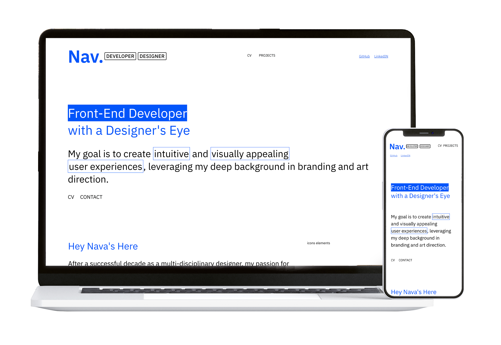

📌 Portfolio Website
My portfolio website showcases selected work in Front-End Development and UI Design, serving as digital business card.
It was designed and built from scratch using Figma, HTML, CSS, and JavaScript, with clean semantic code .
🔗 **Live Demo:** https://navdevdesign.netlify.app

🎯 Project Goals
Present selected projects in a clear and structured way.
Highlight Front-End skills: HTML, CSS, JS, Grid, Flexbox.
Demonstrate design thinking and user experience (UX/UI) abilities.
Serve as a live project for my job application process.

📸 Preview

🖥 Technologies
HTML5 – Semantic, accessible structure.
CSS3 – Responsive design with Grid and Flexbox.
JavaScript – Dynamic content loading from JSON.
Git & GitHub – Version control and deployment.

🤖 AI Assistance
I utilized ChatGPT as a coding companion for assistance with JavaScript during the development process.

📂 Website Structure
Home Page – Intro section , project showcase and profesional expirense.
Project Pages – Each project includes images and description.
Support Files – Separate CSS and JS files for maintainability.

🚀 Key Features
Dynamic project content loading.
Fully responsive layout for all screen sizes.
ֿSemantic markup.
Easy scalability for adding future projects.

## License
This project is licensed under the MIT License — see the [LICENSE](LICENSE) file for details.  
You are free to download, use, and modify the source code, including for commercial purposes, provided that attribution is given to the original author.
## Design Files
The original design files for this project are available in Figma and are shared publicly under the same MIT License terms.  
You may view and download them under the same MIT License terms:  
[link here](https://www.figma.com/community/file/1537542547669411554/portfolio-starter-components-variables-docs)
