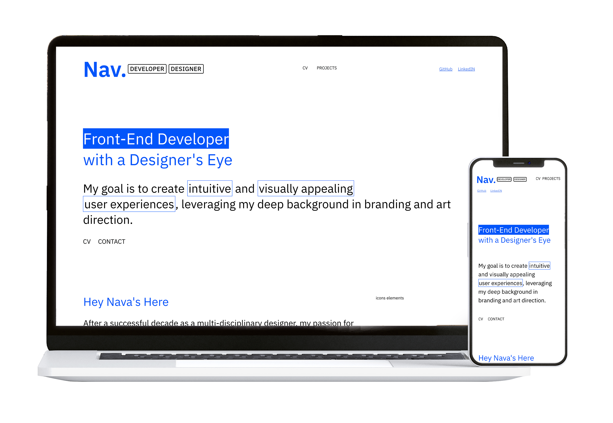

📌 Portfolio Website
My portfolio website showcases selected work in Front-End Development and UI Design, serving as digital business card.
It was designed and built from scratch using Figma, HTML, CSS, and JavaScript, with clean semantic code .

🎯 Project Goals
Present selected projects in a clear and structured way.
Highlight Front-End skills: HTML, CSS, JS, Grid, Flexbox.
Demonstrate design thinking and user experience (UX/UI) abilities.
Serve as a live project for my job application process.

🖥 Technologies
HTML5 – Semantic, accessible structure.
CSS3 – Responsive design with Grid and Flexbox.
JavaScript – Dynamic content loading from JSON.
Git & GitHub – Version control and deployment.

📂 Website Structure
Home Page – Intro section , project showcase and profesional expirense.
Project Pages – Each project includes images and description.
Support Files – Separate CSS and JS files for maintainability.

🚀 Key Features
Dynamic project content loading.
Fully responsive layout for all screen sizes.
ֿSemantic markup.
Easy scalability for adding future projects.

📸 Preview

